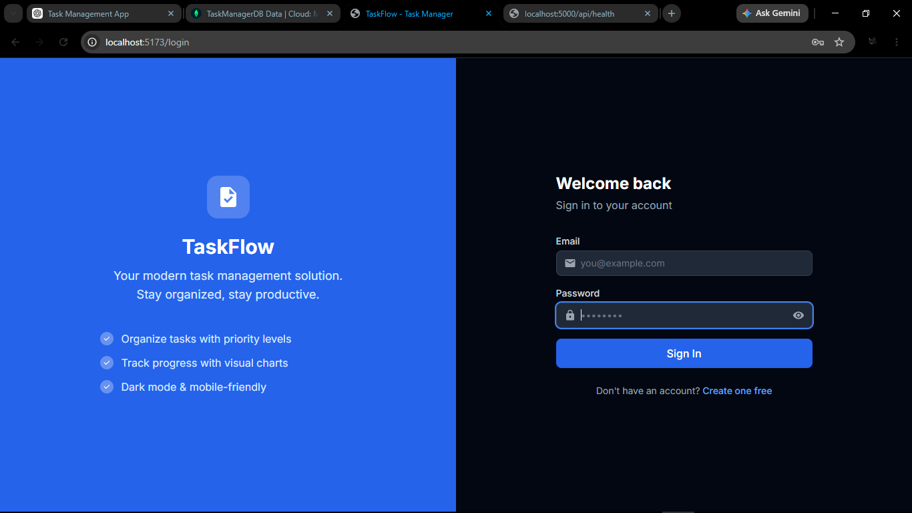
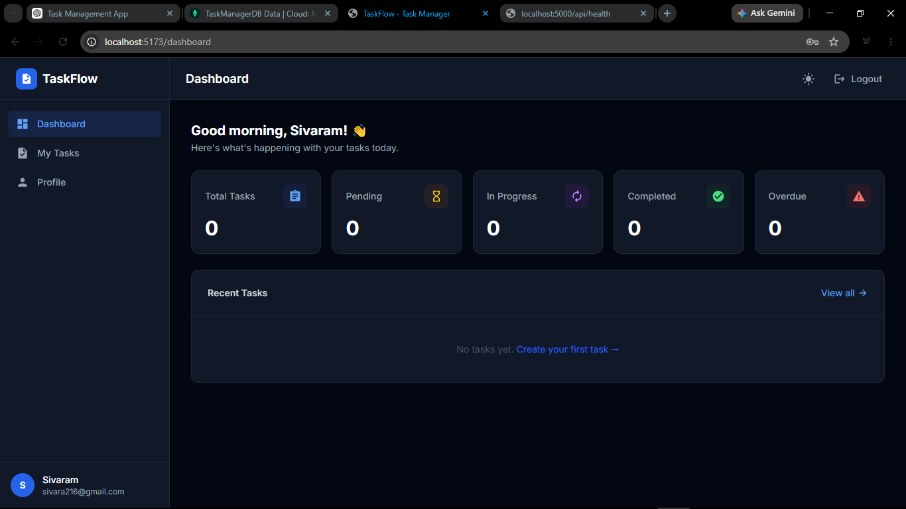
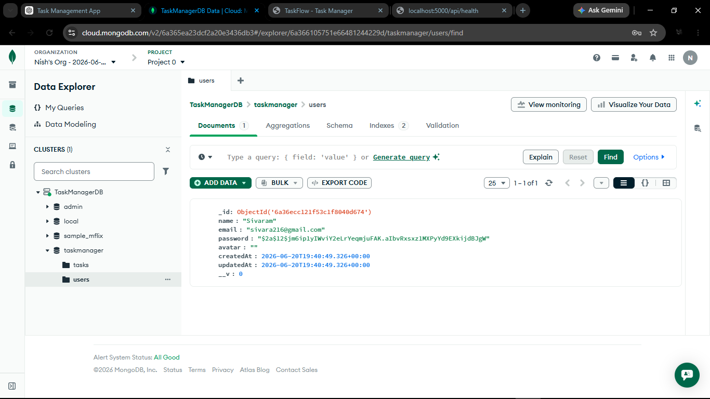

# TaskFlow - Task Management Application

## 📌 Project Overview

TaskFlow is a full-stack Task Management Application developed to help users create, organize, update, and track tasks efficiently. The application provides secure authentication, task management capabilities, dashboard analytics, and a responsive user interface for both desktop and mobile devices.

This project demonstrates the implementation of a complete full-stack web application using modern technologies including React.js, Node.js, Express.js, and MongoDB Atlas.

---

## 🚀 Features

### Authentication & Authorization
- User Registration
- User Login
- JWT-based Authentication
- Protected Routes
- User Profile Management
- Secure Password Hashing

### Task Management
- Create Tasks
- View Tasks
- Update Tasks
- Delete Tasks
- Task Status Tracking
- Task Priority Management
- Search Tasks
- Filter Tasks
- Sort Tasks

### Dashboard
- Task Statistics Overview
- Completion Percentage Tracking
- Recent Tasks Display
- Analytics & Charts

### User Experience
- Responsive Design
- Mobile-Friendly Interface
- Dark/Light Theme Support
- Toast Notifications
- Loading States
- Modern UI Design

---

## 🛠️ Technology Stack

### Frontend
- React.js
- Vite
- React Router DOM
- Axios
- Tailwind CSS
- React Hot Toast
- Context API

### Backend
- Node.js
- Express.js
- JWT Authentication
- bcryptjs
- Express Validator
- Morgan

### Database
- MongoDB Atlas
- Mongoose ODM

---

## 📂 Project Structure

```text
taskflow/
│
├── frontend/
│   ├── src/
│   │   ├── components/
│   │   ├── context/
│   │   ├── pages/
│   │   ├── services/
│   │   ├── App.jsx
│   │   └── main.jsx
│   │
│   ├── public/
│   ├── package.json
│   └── vite.config.js
│
├── backend/
│   ├── config/
│   │   └── db.js
│   │
│   ├── middleware/
│   ├── models/
│   │   ├── User.js
│   │   └── Task.js
│   │
│   ├── routes/
│   │   ├── authRoutes.js
│   │   └── taskRoutes.js
│   │
│   ├── server.js
│   └── package.json
│
├── README.md
└── .gitignore
```

---

## ⚙️ Installation Guide

### 1️⃣ Clone Repository

```bash
git clone https://github.com/your-username/taskflow.git
cd taskflow
```

---

### 2️⃣ Backend Setup

Navigate to backend:

```bash
cd backend
```

Install dependencies:

```bash
npm install
```

Create `.env` file:

```env
PORT=5000
NODE_ENV=development

MONGODB_URI=your_mongodb_atlas_connection_string

JWT_SECRET=your_secret_key
JWT_EXPIRE=7d

CLIENT_URL=http://localhost:5173
```

Start backend server:

```bash
npm run dev
```

Backend runs at:

```text
http://localhost:5000
```

---

### 3️⃣ Frontend Setup

Navigate to frontend:

```bash
cd frontend
```

Install dependencies:

```bash
npm install
```

Create `.env` file:

```env
VITE_API_URL=http://localhost:5000/api
```

Start frontend server:

```bash
npm run dev
```

Frontend runs at:

```text
http://localhost:5173
```

---

## 🔗 API Endpoints

### Authentication APIs

| Method | Endpoint | Description |
|----------|----------|----------|
| POST | /api/auth/register | Register User |
| POST | /api/auth/login | Login User |
| GET | /api/auth/profile | Get Profile |
| PUT | /api/auth/profile | Update Profile |

### Task APIs

| Method | Endpoint | Description |
|----------|----------|----------|
| GET | /api/tasks | Get All Tasks |
| GET | /api/tasks/:id | Get Task By ID |
| POST | /api/tasks | Create Task |
| PUT | /api/tasks/:id | Update Task |
| DELETE | /api/tasks/:id | Delete Task |

### Dashboard APIs

| Method | Endpoint | Description |
|----------|----------|----------|
| GET | /api/tasks/stats | Dashboard Statistics |

---

## 🗄️ Database Collections

### Users Collection

Stores:

- Name
- Email
- Password (Hashed)
- Created Date

### Tasks Collection

Stores:

- Title
- Description
- Status
- Priority
- User Reference
- Created Date
- Updated Date

---

## 🔐 Security Features

- JWT Authentication
- Password Hashing using bcryptjs
- Protected Routes
- Environment Variable Configuration
- Input Validation
- Secure API Access

---

## 📸 Application Screens

- User Registration Page
- User Login Page
- Dashboard
- Tasks Management Page
- User Profile Page
- MongoDB Atlas Database

---

## Application Screenshots

### Login Page



### Dashboard Page



### MongoDB Atlas Collections



---

## 🎯 Learning Outcomes

This project demonstrates:

- Full Stack Application Development
- Frontend & Backend Integration
- REST API Development
- MongoDB Database Operations
- Authentication & Authorization
- Dynamic Data Handling
- Responsive UI Development

---

## 📈 Future Enhancements

- Real-Time Updates using Socket.IO
- Kanban Board
- Task Categories
- Due Date Reminders
- Team Collaboration
- File Attachments
- Email Notifications

---

## 👨‍💻 Author

Developed as part of a Full Stack Development Internship Project.

**TaskFlow – Task Management Application**

Built using ❤️ React.js, Node.js, Express.js, and MongoDB Atlas.
